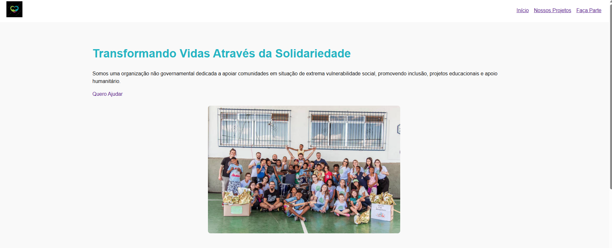
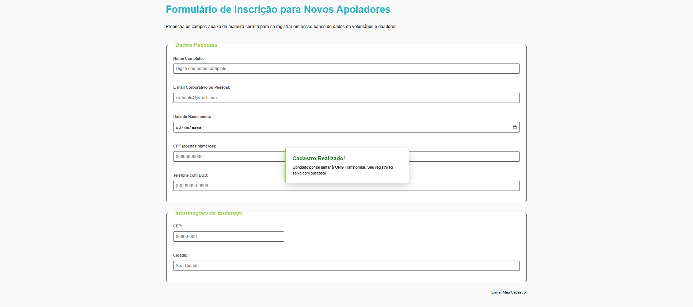
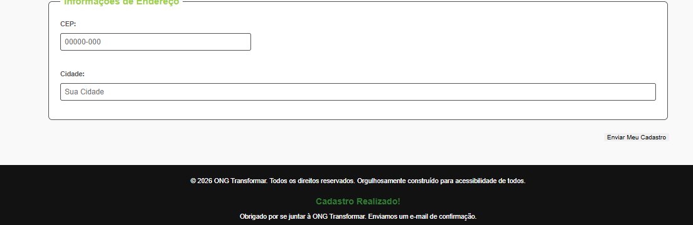
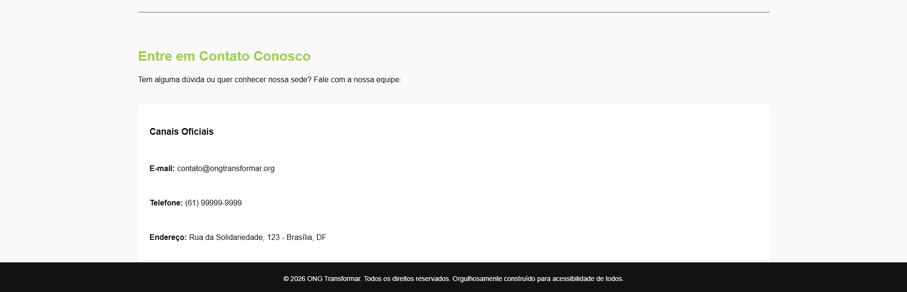

# 🚀 Projeto SPA - ONG Transformar

Este é um projeto de uma aplicação web de página única (Single Page Application - SPA) desenvolvida com **JavaScript Puro (Vanilla JS)**, HTML5 e CSS3. O objetivo do sistema é gerenciar a interface institucional e o cadastro de novos apoiadores para a ONG Transformar.

## 🛠️ Tecnologias Utilizadas
* **HTML5** (Estruturação semântica e acessibilidade)
* **CSS3** (Design System baseado em Grid de 12 colunas e Flexbox)
* **JavaScript Moderno (ES6+)** (Arquitetura modular, rotas dinâmicas e validações)

## 📌 Funcionalidades Implementadas
* **Arquitetura SPA:** Sistema de rotas dinâmicas baseado em Hash (`#/`), permitindo a troca de conteúdos sem recarregar a página (reatividade total).
* **Organização Modular:** Código JavaScript separado em arquivos independentes (`app.js`, `router.js` e `validation.js`) utilizando `import` e `export`.
* **Validação Rigorosa de Formulário:** Verificação de tamanho mínimo de strings, uso de `.trim()` para barrar campos apenas com espaços, checagem de formato de e-mail e algoritmo matemático para validação de **CPF Real**.
* **Foco Automático (UX):** O navegador rola a tela e foca automaticamente no primeiro campo que falhar na validação.
* **Persistência Local (Web Storage):** Ciclo completo de gravação e recuperação de dados utilizando `localStorage` combinado com `JSON.stringify` e `JSON.parse` para manter a sessão do usuário mesmo após recarregar.
* **Acessibilidade Visual:** Asteriscos de obrigatoriedade sinalizados de forma semântica utilizando `aria-hidden="true"` para não atrapalhar leitores de tela.

## 📂 Estrutura de Pastas
```text
PROJETO ONG/
├── css/
│   └── style.css
├── html/
│   ├── cadastro.html
│   └── projetos.html
├── images/
│   ├── favicon.ico
│   ├── logo-ong.jpeg
│   └── ong-fachada.jpeg
├── js/
│   ├── app.js
│   ├── router.js
│   └── validation.js
├── index.html
└── README.md
```
 ## 📷 Screenshots das Telas

### 🏠 Página Inicial (Início)


### 📋 Nossos Projetos


### ✍️ Faça Parte (Formulário de Cadastro)


### 📞 Contatos e Canais Oficiais



## 💻 Como Rodar o Projeto Localmente
1. Faça o clone ou baixe a pasta do projeto.
2. Abra a pasta raiz no **VS Code**.
3. Instale a extensão **Live Server**.
4. Clique com o botão direito no arquivo `index.html` e selecione **Open with Live Server**.
